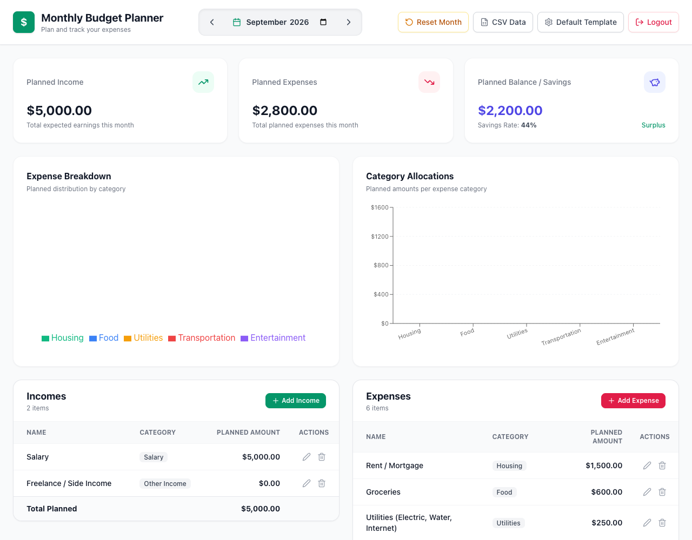
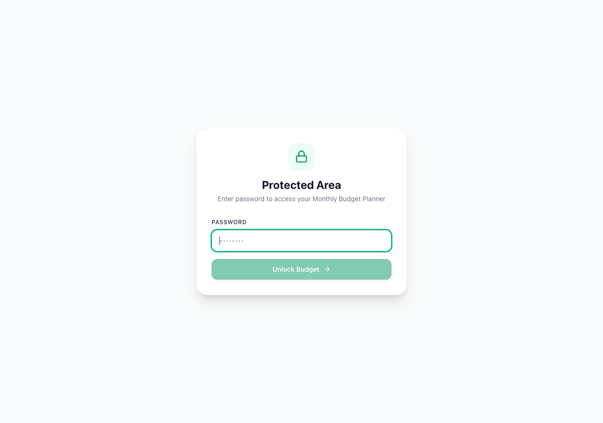

# 💰 Monthly Budget Planner

A clean, modern, and lightweight monthly budget planner built with Next.js 14, Tailwind CSS, Recharts, and local SQLite (`better-sqlite3`).

Designed strictly as a **forward-looking budget planner** (not an expense tracker)—allowing you to plan your expected monthly incomes, organize expense categories, and visualize your target savings rate without the overhead of tracking daily receipts and variance.

---

## 📸 Screenshots

### Dashboard Overview


### Password Protection


---

## ✨ Features & Functionalities

- **Forward-Looking Budget Planning**: Focused exclusively on planned income, planned expenses, and projected savings. Clean, simple, and clutter-free.
- **Month-by-Month Lifecycle**:
  - Browse between months using previous/next navigation or the native date picker.
  - New months automatically initialize with your customizable default budget template.
- **Template Management**:
  - **Default Monthly Template**: Customize standard recurring incomes and expenses that automatically populate any newly created month.
  - **Set Current Month as Template**: Turn any existing month's configured items into the default template with one click.
  - **Reset Month to Template**: Restore/revert any month's budget items back to the default template.
- **Visual Analytics & KPI Cards**:
  - **Planned Income**: Total expected monthly earnings.
  - **Planned Expenses**: Total projected monthly expenses.
  - **Planned Balance / Savings**: Net projected savings, savings rate percentage, and surplus/deficit indicator.
  - **Expense Breakdown**: Donut chart displaying the percentage distribution of expenses across categories.
  - **Category Allocations**: Visual bar chart ranking planned spending per category.
- **Budget Item Management**:
  - Add items with type (`income` or `expense`), custom category, and planned amount.
  - Inline editing: Edit item names and amounts directly in the table with immediate updates.
  - Delete items with automatic totals recalculation.
- **CSV Backup & Restore**:
  - **Export**: Download budget data as CSV for the current month or all recorded months (`month,type,category,name,amount,notes`).
  - **Import**: Upload CSV files with automatic format validation and atomic SQLite transactional insertion. Backwards-compatible with legacy budget exports.
- **Password-Only Authentication**:
  - Protect your budget when deployed to the public internet using a single password (`AUTH_PASSWORD`).
  - Implemented via Next.js Middleware with cryptographic SHA-256 token hashing and secure HTTP-only cookies.
  - Fully optional: If `AUTH_PASSWORD` is omitted or empty, authentication is automatically bypassed for local development.
- **Local SQLite Storage**:
  - Zero external database dependencies.
  - High performance with SQLite WAL (Write-Ahead Logging) mode enabled.

---

## 🛠️ Tech Stack

- **Framework**: [Next.js 14](https://nextjs.org/) (App Router, Server Actions, Route Handlers)
- **Language**: TypeScript
- **Styling**: [Tailwind CSS](https://tailwindcss.com/) & [Lucide React](https://lucide.dev/)
- **Charts**: [Recharts](https://recharts.org/)
- **Database**: [SQLite](https://www.sqlite.org/) via [`better-sqlite3`](https://github.com/WiseLibs/better-sqlite3)
- **CSV Processing**: [Papa Parse](https://www.papaparse.com/)
- **Testing**: Node.js native test runner (`node:test`) with `tsx`

---

## 🚀 Getting Started (Local Development)

### Prerequisites

- [Node.js 20+](https://nodejs.org/)
- npm / pnpm / yarn

### Installation

1. **Clone the repository**:
   ```bash
   git clone https://github.com/your-username/monthly-planner.git
   cd monthly-planner
   ```

2. **Install dependencies**:
   ```bash
   npm install
   ```

3. **Configure environment variables**:
   Create a `.env` file in the root directory:
   ```env
   # Optional: set a password to enable authentication (leave empty to disable)
   AUTH_PASSWORD=your_secure_password

   # Optional: customize database path (defaults to ./data/budget.db)
   DB_PATH=./data/budget.db

   # Optional: customize port (defaults to 3000)
   PORT=3000
   ```

4. **Run the development server**:
   ```bash
   npm run dev
   ```
   Open [http://localhost:3000](http://localhost:3000) in your browser.

5. **Run test suite**:
   ```bash
   npm test
   ```

6. **Build for production**:
   ```bash
   npm run build
   npm start
   ```

---

## 🐳 Docker Deployment

The application includes a production-ready, multi-stage `Dockerfile` and `docker-compose.yml` configured for containerized deployment (e.g. on a DigitalOcean droplet, Linode, or any VPS).

### 1. Docker Architecture

- **Multi-Stage Build**:
  - `deps`: Installs dependencies with native build tools (`libc6-compat`, `python3`, `make`, `g++`) required for `better-sqlite3`.
  - `builder`: Compiles the Next.js production bundle.
  - `runner`: Lightweight Alpine production container running `npm start`.
- **Persistent Storage**:
  - Mounts `./data:/app/data` so that your SQLite database (`budget.db`) persists across container restarts, rebuilds, and updates.

---

### 2. Deployment with Traefik Reverse Proxy (Recommended)

If you use [Traefik](https://traefik.io/) as a reverse proxy on your droplet with Let's Encrypt SSL, the provided [`docker-compose.yml`](docker-compose.yml) is ready out of the box:

```yaml
services:
  monthly-planner:
    build:
      context: .
      dockerfile: Dockerfile
    image: monthly-planner:latest
    container_name: monthly-planner
    restart: unless-stopped
    volumes:
      - ./data:/app/data
    env_file:
      - .env
    environment:
      - NODE_ENV=production
      - PORT=3000
      - DB_PATH=/app/data/budget.db
      - AUTH_PASSWORD=${AUTH_PASSWORD:-}
    labels:
      - "traefik.enable=true"
      - "traefik.http.routers.monthly-planner.rule=Host(`budget.jaymayu.com`)"
      - "traefik.http.routers.monthly-planner.entrypoints=websecure"
      - "traefik.http.routers.monthly-planner.tls.certresolver=letsencrypt"
      - "traefik.http.services.monthly-planner.loadbalancer.server.port=3000"
    networks:
      - web

networks:
  web:
    external: true
```

#### Steps to Deploy:

1. **Copy project files to your server**:
   ```bash
   rsync -avz --exclude 'node_modules' --exclude '.next' ./ user@your-server:~/monthly-planner/
   ```

2. **Set up your `.env` file on the server**:
   ```bash
   cd ~/monthly-planner
   cat <<EOF > .env
   NODE_ENV=production
   PORT=3000
   DB_PATH=/app/data/budget.db
   AUTH_PASSWORD=your_super_secret_password
   EOF
   ```

3. **Update domain in `docker-compose.yml`**:
   Replace `budget.jaymayu.com` in `traefik.http.routers.monthly-planner.rule` with your actual domain.

4. **Build and launch the container**:
   ```bash
   docker compose up -d --build
   ```

5. **Verify the container is running**:
   ```bash
   docker compose ps
   docker compose logs -f
   ```

---

### 3. Standalone Docker Deployment (Without Traefik)

If you prefer to run the container directly or bind it to a specific host port (e.g., behind NGINX, Cloudflare Tunnel, or directly):

1. **Uncomment the `ports` mapping in `docker-compose.yml`**:
   ```yaml
   ports:
     - "3000:3000"
   ```
   *(Remove the `networks` and `labels` blocks if you are not using Traefik)*.

2. **Or run directly via Docker CLI**:
   ```bash
   # Build the image
   docker build -t monthly-planner:latest .

   # Run container with persistent data volume
   docker run -d \
     --name monthly-planner \
     --restart unless-stopped \
     -p 3000:3000 \
     -v $(pwd)/data:/app/data \
     -e NODE_ENV=production \
     -e DB_PATH=/app/data/budget.db \
     -e AUTH_PASSWORD="your_secure_password" \
     monthly-planner:latest
   ```

---

## 🔒 Environment Variables Reference

| Variable | Default | Description |
| :--- | :--- | :--- |
| `AUTH_PASSWORD` | *(empty)* | Password for dashboard protection. If not set, authentication is bypassed. |
| `DB_PATH` | `./data/budget.db` | Absolute or relative path to the SQLite database file (`/app/data/budget.db` in Docker). |
| `PORT` | `3000` | Port on which the application listens. |
| `NODE_ENV` | `development` | Set to `production` in production environments. |

---

## 📄 License

MIT License. Feel free to use, modify, and self-host!
