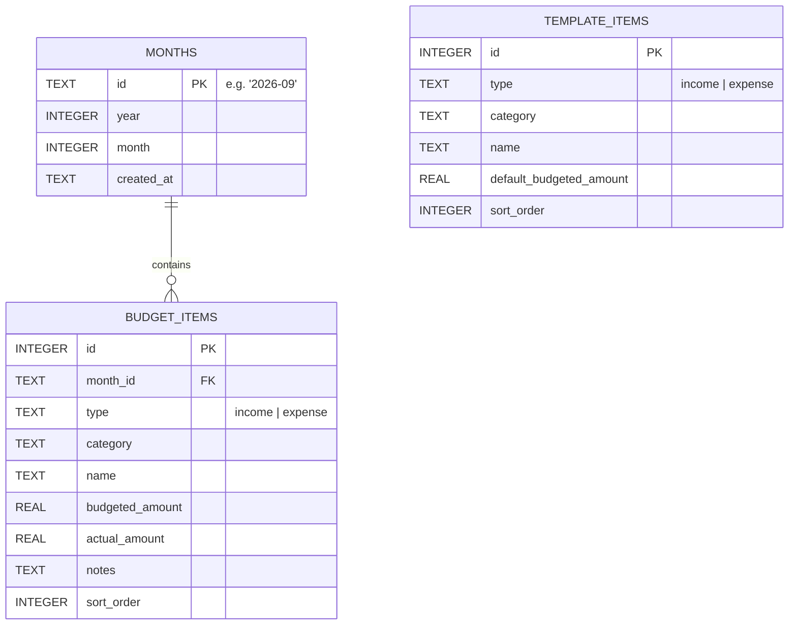

# Monthly Budget Planner - System Design Document

**Date:** 2026-09-22  
**Status:** Approved by User  
**Target Stack:** Next.js (App Router), TypeScript, SQLite (`better-sqlite3`), Tailwind CSS, Recharts / Chart.js

---

## 1. Executive Summary
The Monthly Budget Planner is a web-based personal finance application backed by a local SQLite database. It empowers users to plan and track their monthly income and expenses on a month-by-month basis starting with the current month (or any selected month). 

Key highlights:
- **Month Lifecycle & Auto-Population**: When a user selects a month, the system initializes that month in the SQLite database and auto-populates it with customizable default template items.
- **Budget vs. Actual Tracking**: Users can specify planned/budgeted amounts and log actual amounts with real-time variance calculations.
- **Custom Line Items**: Full flexibility to add, edit, or delete custom income and expense items and assign categories.
- **Visual Analytics**: Interactive pie/donut charts breakdown expenses by category and bar charts compare planned vs. actual amounts.
- **Data Portability**: Built-in CSV export and import capabilities to backup and restore SQLite data anytime.

---

## 2. Architecture & Tech Stack

### 2.1 Technology Stack
- **Framework**: Next.js 14+ (App Router, Server Actions, TypeScript)
- **Database**: SQLite 3 with `better-sqlite3` driver
- **Styling**: Tailwind CSS with a clean, responsive card-based dashboard
- **Visualizations**: Recharts for responsive SVG-based charts (Donut chart for expense distribution, Grouped Bar chart for Budget vs. Actual)
- **File Parsing**: `papaparse` or lightweight native CSV parser for CSV import/export

### 2.2 System Architecture & Directory Structure
```
monthly-planner/
├── data/
│   └── budget.db                # Persistent SQLite database file
├── docs/
│   └── superpowers/specs/       # Specifications and design docs
├── src/
│   ├── app/
│   │   ├── api/
│   │   │   ├── export/route.ts  # CSV export endpoint
│   │   │   └── import/route.ts  # CSV import endpoint
│   │   ├── globals.css
│   │   ├── layout.tsx
│   │   └── page.tsx             # Main dashboard page
│   ├── components/
│   │   ├── Header.tsx           # Navigation and month selector
│   │   ├── KpiCards.tsx         # Income, Expenses, Net Savings summary
│   │   ├── Charts.tsx           # Expense Breakdown (Donut) & Budget vs Actual (Bar)
│   │   ├── BudgetTable.tsx      # Incomes & Expenses editable tables
│   │   ├── AddItemModal.tsx     # Modal to add custom items
│   │   ├── TemplateModal.tsx    # Settings modal to configure default template
│   │   └── CsvDataModal.tsx     # Modal to export/import CSV data
│   ├── lib/
│   │   ├── db.ts                # SQLite database connection & migrations
│   │   ├── actions.ts           # Next.js Server Actions for CRUD & analytics
│   │   └── types.ts             # TypeScript interfaces and schemas
├── package.json
├── tsconfig.json
└── tailwind.config.ts
```

---

## 3. Data Model & Database Schema

The database resides at `data/budget.db`. WAL (Write-Ahead Logging) mode is enabled for concurrency and performance.

### 3.1 Tables



#### Table Definitions:
1. **`months`**:
   - `id` (TEXT PRIMARY KEY): `YYYY-MM` format (e.g., `'2026-09'`).
   - `year` (INTEGER): Calendar year (e.g., `2026`).
   - `month` (INTEGER): Calendar month (1 to 12).
   - `created_at` (TEXT): ISO timestamp.

2. **`template_items`**:
   - `id` (INTEGER PRIMARY KEY AUTOINCREMENT).
   - `type` (TEXT): `'income'` or `'expense'`.
   - `category` (TEXT): E.g., `'Fixed Income'`, `'Housing'`, `'Utilities'`, `'Food'`, `'Discretionary'`.
   - `name` (TEXT): E.g., `'Salary'`, `'Rent'`, `'Groceries'`, `'Electric Bill'`.
   - `default_budgeted_amount` (REAL): Default planned amount.
   - `sort_order` (INTEGER): Ordering priority.

3. **`budget_items`**:
   - `id` (INTEGER PRIMARY KEY AUTOINCREMENT).
   - `month_id` (TEXT, FOREIGN KEY references `months(id)`).
   - `type` (TEXT): `'income'` or `'expense'`.
   - `category` (TEXT).
   - `name` (TEXT).
   - `budgeted_amount` (REAL): Budgeted/planned amount.
   - `actual_amount` (REAL): Actual amount spent or received.
   - `notes` (TEXT, nullable).
   - `sort_order` (INTEGER).

### 3.2 Initial Default Seed Data
On initial database creation, `template_items` is seeded with:
- **Incomes**:
  - *Salary* (Category: `Salary`, Budgeted: `$5,000.00`)
  - *Other Income / Freelance* (Category: `Other Income`, Budgeted: `$0.00`)
- **Expenses**:
  - *Rent / Mortgage* (Category: `Housing`, Budgeted: `$1,500.00`)
  - *Groceries* (Category: `Food`, Budgeted: `$600.00`)
  - *Utilities (Electric, Water, Internet)* (Category: `Utilities`, Budgeted: `$250.00`)
  - *Dining Out* (Category: `Food`, Budgeted: `$200.00`)
  - *Transportation / Gas* (Category: `Transportation`, Budgeted: `$150.00`)
  - *Entertainment / Subscriptions* (Category: `Entertainment`, Budgeted: `$100.00`)

---

## 4. Core Workflows & Logic

### 4.1 Month Initialization Flow (`getOrCreateMonth`)
1. User selects or switches to a month (e.g. `2026-09`).
2. Server checks if `months` record exists for `2026-09`.
3. If not found:
   - Inside an atomic SQLite transaction:
     - Insert `months` row with `id = '2026-09'`.
     - Fetch all rows from `template_items`.
     - Insert corresponding rows into `budget_items` with `month_id = '2026-09'`, `budgeted_amount = default_budgeted_amount`, and `actual_amount = 0`.
4. Return the month along with all active `budget_items`.

### 4.2 CRUD Operations on Budget Items
- **Add Item**: Allows adding a new line item to the current month specifying type (`income` / `expense`), category, name, budgeted amount, and optional actual amount.
- **Update Item**: In-place edits to budgeted amount, actual amount, name, or category. Recalculates month KPI and chart aggregations immediately.
- **Delete Item**: Deletes an item from the current month.

### 4.3 Template Management
- Settings modal allows editing the base `template_items`.
- Any changes made in the template will be used for future months that have not yet been initialized.

### 4.4 Analytics & Aggregations
Given a `monthId`:
- **Total Budgeted Income** = $\sum \text{budgeted\_amount}$ where `type = 'income'`
- **Total Actual Income** = $\sum \text{actual\_amount}$ where `type = 'income'`
- **Total Budgeted Expenses** = $\sum \text{budgeted\_amount}$ where `type = 'expense'`
- **Total Actual Expenses** = $\sum \text{actual\_amount}$ where `type = 'expense'`
- **Net Planned Savings** = $\text{Total Budgeted Income} - \text{Total Budgeted Expenses}$
- **Net Actual Savings** = $\text{Total Actual Income} - \text{Total Actual Expenses}$
- **Category Expense Breakdown**: Grouped actual spending by category for the pie chart.

### 4.5 CSV Export and Import
- **Export**:
  - Endpoint `/api/export?month=all` or `/api/export?month=YYYY-MM`.
  - Generates CSV with headers: `month,type,category,name,budgeted_amount,actual_amount,notes`.
  - Dispatches browser file download (`budget-export-YYYY-MM-DD.csv`).
- **Import**:
  - Endpoint `/api/import` handles `multipart/form-data` with CSV file.
  - Validates CSV header structure and data types.
  - Supports Merge/Insert mode: creates non-existent months, inserts/updates items inside a single database transaction.

---

## 5. UI/UX Design

### 5.1 Dashboard Layout
- **Top Bar**:
  - Title & Logo: Monthly Budget Planner.
  - Month Navigator: `[ < Previous Month ]` `[ Month Dropdown / Picker ]` `[ Next Month > ]`.
  - Action buttons: `[ 📥 Export/Import CSV ]` `[ ⚙️ Template Settings ]`.
- **Summary KPI Cards**:
  - 3 primary cards:
    - **Total Income**: Planned vs. Actual, % achieved.
    - **Total Expenses**: Planned vs. Actual, remaining budget.
    - **Net Savings**: Planned vs. Actual, surplus/deficit status.
- **Visual Charts Section (2 Columns)**:
  - **Left**: Donut Chart of Expenses by Category with hover tooltips and legend showing percentage and dollar totals.
  - **Right**: Grouped Bar Chart comparing Budgeted vs. Actual by category.
- **Data Tables Section (2 Columns / Tabs)**:
  - **Incomes Card**: List of income items with inline editing, quick delete, and `+ Add Income` button.
  - **Expenses Card**: List of expense items with inline editing, quick delete, and `+ Add Expense` button.

---

## 6. Error Handling & Validation
- **Input Validation**:
  - Months restricted to regex `^\d{4}-(0[1-9]|1[0-2])$`.
  - Amounts validated as numeric $\ge 0$.
  - Item names must be non-empty.
- **Transaction Safety**: All multi-row database updates (new month creation, CSV import) run within `db.transaction()` to guarantee atomicity.
- **Client Feedback**: Clear UI notifications / toast alerts on successful saves, edits, imports, or errors.

---

## 7. Testing & Verification
1. **Database Unit Tests**:
   - Schema creation and migration.
   - Default template seeding.
   - `getOrCreateMonth` behavior: first creation vs retrieval.
   - CSV export generation and CSV import validation.
2. **Integration & Manual UI Tests**:
   - Launch dev server (`npm run dev`).
   - Open browser, verify current month initializes with default template.
   - Add new custom income and expense items; verify inline editing.
   - Confirm pie chart and bar chart dynamically re-render with accurate numbers.
   - Export CSV, inspect format; import CSV, confirm state restoration.
